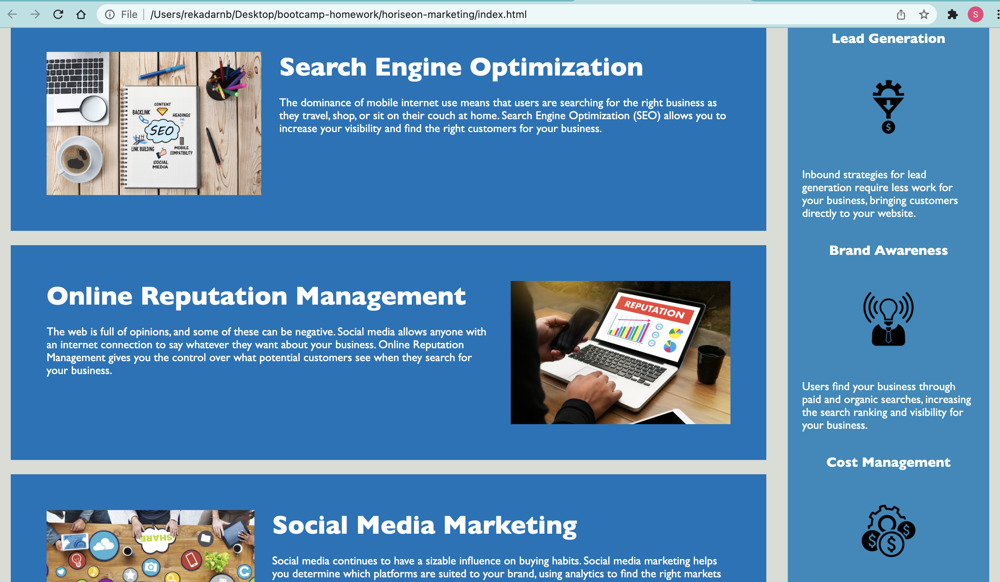

# hw1-code-refactor

## DESCRIPTION

This is a refactoring project for Horiseon Marketing to make their website more SEO friendly. Prior to the refactoring, the website was non-semantic and did not make the website search-friendly. The project was completed using HTML & CSS elements.

## PROJECT SCREENSHOT
 

## DEPLOYED APPLICATION

https://github.com/ssbbgm/hw1-code-refactor/